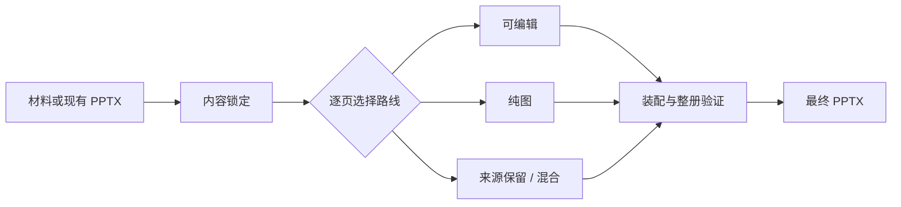

# Deck Studio / PPT 工作台

> 先锁定内容，再为每一页选择可编辑、纯图或混合路线，最终交付一套能用、能改、能验证的 PPT。

[](LICENSE)
[](https://www.python.org/)

Deck Studio 是面向 Codex、Claude Code 等 Agent 的统一 PPT 生产 Skill。它同时支持从零制作、已有稿
精修、合并改版和混合装配，并把内容锁定、视觉路由与最终 PPTX 验收放在同一条工作流里。

## 一套完整 PPT，需要三个判断

### 内容先锁定

先把听众、目标、逐页主张和证据讲清楚，再进入正式生产。客户可见文案与内部工作注记分离，减少
制作过程中的口径漂移。

### 每页选择合适的实现方式

数据、图表和持续修改内容保持原生可编辑；封面、章节和关键情绪页可以使用整页视觉；复杂原页和
真实资产按来源保留。整册可以灵活组合多种制作方式。

### 验收真实文件

交付前检查最终 PPTX 的文字、字体、背景、图表、媒体关系、页面路由和整册一致性。仓库包含 94 项
回归测试，并提供一组可直接运行的审计与验证工具。

## 四种生产路线

| 路线 | 适合场景 | 交付重点 |
| --- | --- | --- |
| 可编辑 | 数据、表格、案例、多媒体、持续修改 | 原生文本、图表和对象关系 |
| 纯图 | 演讲、发布、课程、视觉冲击优先 | 文案冻结、整页校对、统一视觉 |
| 混合 | 客户提案、策略汇报、品牌方案 | 正文可编辑，少量关键页整图 |
| 精修 | 已有 PPT 内容基本成立 | 保留内容关系，统一设计并修复兼容问题 |



## 快速安装

需要 Python 3.10 或更高版本。

### Codex

```bash
git clone https://github.com/JoeSangAI/deck-studio.git ~/.codex/skills/deck-studio
cd ~/.codex/skills/deck-studio
python3 -m venv .venv
.venv/bin/python -m pip install -r requirements.txt
```

### Claude Code

```bash
git clone https://github.com/JoeSangAI/deck-studio.git ~/.claude/skills/deck-studio
cd ~/.claude/skills/deck-studio
python3 -m venv .venv
.venv/bin/python -m pip install -r requirements.txt
```

安装后重新启动 Agent，直接提出任务即可：

```text
帮我把这份材料做成一套给管理层汇报的 PPT，先梳理逐页内容，再决定哪些页面保持可编辑。
```

```text
精修这份 PPT，内容不变，统一整册视觉并检查最终文件。
```

## 它如何工作

1. 识别任务属于从零制作、已有稿精修、继续修改还是合并重做。
2. 对会改变叙事的任务先完成逐页内容锁定。
3. 根据页面用途选择可编辑、纯图、来源保留或参考融合路线。
4. 按页型家族统一字体、背景、边距、图像关系和改造强度。
5. 装配最终 PPTX，并运行与任务风险匹配的验证工具。

完整工作规范见 [SKILL.md](SKILL.md)。

## 自带的质量工具

- `templates/deck_audit.py`：审计整册结构、字体和资源；
- `templates/verify_pptx.py`：核对已有稿修改后的内容与资源保真；
- `templates/typography_audit.py`：检查字体家族、继承字体和字号阶梯；
- `templates/verify_background_consistency.py`：检查同类页面的精确背景色；
- `templates/verify_route_integrity.py`：检查可编辑页、纯图页和 Overlay 是否符合路线清单；
- `templates/verify_page_plan.py`：检查逐页内容与生产契约；
- `scripts/contact_sheet.py`：生成整册轻量总览，用于视觉复核。

## 依赖与可选能力

普通 PPT 工作流、审计工具和验证脚本都在本仓库内，不依赖本机软链接或个人目录。

- 制作纯图页面需要可用的图片生成能力；直接运行 `scripts/gen_deck.py` 时，通过环境变量提供
  `OPENAI_API_KEY`，不要把密钥写入仓库。
- 分众传媒相关能力是可选扩展，仅在任务明确涉及分众知识、历史原页或媒体环境时使用。具体契约见
  [分众集成说明](references/focusmedia-integration.md)；缺少这些扩展不会影响普通 PPT 工作流。
- `presentations` 等专业演示文稿 Skill 可增强原生 PPTX 生产与渲染能力，但不属于本仓库内容。

## 本地验证

```bash
.venv/bin/python -m pip install -r requirements-dev.txt
.venv/bin/python -m pytest -q
```

本次公开版本已在独立的 Python 3.11 环境中重新安装依赖并通过全部 94 项测试。

## 目录

- `SKILL.md`：统一入口与生产路由；
- `workflows/`：已有稿精修六阶段；
- `references/`：纯图、混合与可选集成规则；
- `knowledge/`：按问题读取的 PPT 设计与兼容知识；
- `templates/`：审计、修复和硬验证工具；
- `scripts/`：大纲派生、整页图生产、装配和质检；
- `tests/`：回归测试；
- `agents/openai.yaml`：Skill 展示与调用元数据。

本地案例默认放在 `cases/`，该目录已被 Git 忽略，避免客户名称、项目路径和私有材料进入公共仓库。

## License 与来源

本项目沿用 [MIT License](LICENSE)。初始纯图管线来自
[张拼拼·XNTJ（Max Pin）的 Deck Studio](https://github.com/xntj-ai/deck-studio)，后续版本扩展了可编辑、
混合、精修、路由和验收能力。原作者版权声明保留在 License 中。

如果这个工作台对你有帮助，欢迎 Star，并通过
[Issues](https://github.com/JoeSangAI/deck-studio/issues) 提交使用问题或改进建议。
